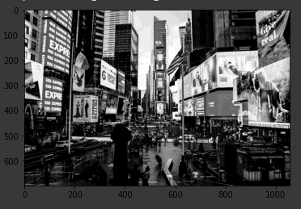
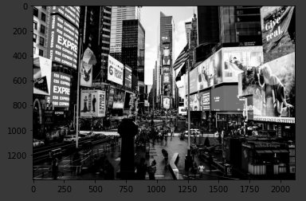

# Proyecto Final: Compresor de imágenes

___


En este proyecto realicé un compresor de imágenes en escala de grises en Python, este permite la reducción del espacio ocupado por una imagen con la menor pérdida de información posible para que su transmisión sea más eficiente.
El compresor que desarrollé tiene una tasa de compresión del 75% es decir reduce la imagen a un cuarto del tamaño original y tiene una perdida de entre 0% y 3% de la información.
Como ejemplo usaré la siguiente imagen de tiene 2114x1400 pixeles, es decir en total ocupa 2959600 bytes.

<p align="center"></p>

Estás son las librerias que hay que importar. En este código también importé la imagen como matriz desde su origen:

```python
%matplotlib inline
import matplotlib.pyplot as plt
import numpy as np
import cv2
import requests
f = open('mm.jpg','wb')
f.write(requests.get('https://www.cerodosbe.com/uploads/s1/10/49/24/10/times-square-foto-anthony-rosset-unsplash.jpeg').content)
f.close()
f1 = cv2.imread('mm.jpg',0)
```

## Compresión:
Como ya sabemos un pixel en escala de grises está dado por un número entre 0 y 255, es decir ocupa un máximo de 8 bits por pixel (o un byte). Para comprimir la imagen la dividí en matrices de 2x2 y convertí cada byte de la matriz en un un número de 4 bits dividiendolo por 17 (esto porque el relutado será un número entro 0 y 15), luego de esto junte los números de la primera columna con los de la segunda para obtener de nuevo un número de 8 bits. Luego repetí el procedimiento pero juntando el número de la primera fila con el de la segunda, así la matriz de 2x2 acaba siendo una matriz de 1x1 es decir un solo número que hará parte de la imagen comprimida.

```python
a=((f1.shape[0])//2)
b=((f1.shape[1])//2)
size=(a, b)
d=((f1.shape[0])//2)*2
e=((f1.shape[0])//2)*2
size1=(d, e)
mediocr = np.zeros(size1)
comprimida = np.zeros(size)
for i in range(((f1.shape[0])//2)*2):
  for j in range(((f1.shape[1])//2)):
    b1=int(round((f1[i, 2*j])/17))<<4
    b2=int(round((f1[i, (2*j)+1])/17))
    col=b1|b2
    mediocr[i, j]=col
for i in range(((f1.shape[0])//2)):
  for j in range(((f1.shape[1])//2)):
    b1=int(round((mediocr[2*i, j])/17))<<4
    b2=int(round((mediocr[(2*i)+1, j])/17))
    col=b1|b2
    comprimida[i, j]=col
    
plt.imshow(comprimida, cmap='Greys_r')
```

<p align="center"></p>


Al comprimir la imagen que tomamos como ejemplo pasa de tener dimensiones de 2114x1400 a tener 1057x700 pixeles y a su vez pasa de ocupar 2959600 bytes a ocupar 739900 bytes, es decir ocupa un cuarto del espacio original.

## Descompresión:
Para descomprimir la imagen realizamos el procedimiento inverso a la compresión. De cada pixel de la imagen debemos hallar la matriz de 2x2. Empezamos por separar el byte correspondiente al pixel en dos números de 4 bits y multiplicamos cada uno por 17, así obtenemos una matriz de dos filas y una columna, por último repetimos el procedimiento para cada número de la nueva matriz para finalmente obtener la matriz de 2x2 y recuperar el tamaño original de la imagen.

```python
a=((comprimida.shape[0])*2)
b=((comprimida.shape[1])*2)
size=(a, b)
mediodes= np.zeros(size)
descomprimida = np.zeros(size)
for i in range(((comprimida.shape[0]))):
  for j in range(((comprimida.shape[1]))):
    col=int(comprimida[i, j])
    b1=(col>>4)*17
    b2=(col&15)*17
    mediodes[2*i, j]=b1
    mediodes[(2*i)+1, j]=b2
for i in range((comprimida.shape[0])*2):
  for j in range((comprimida.shape[1])):
    col=int(mediodes[i, j])
    b1=(col>>4)*17
    b2=(col&15)*17
    descomprimida[i, 2*j]=b1
    descomprimida[i, (2*j)+1]=b2
plt.imshow(descomprimida, cmap='Greys_r')
```

<p align="center"></p>

Al descomprimir la imagen podemos notar que existen pixeles con valores diferentes a los originales, pero muy cercanos. Esto ocurre porque la división entre 17 no siempre será exacta y el residuo de esta es lo que representa el porcentaje de pérdida. Sin embargo este porcentaje es pequeño pues por cada pixel se pierde un máximo de 8 unidades del valor original.
